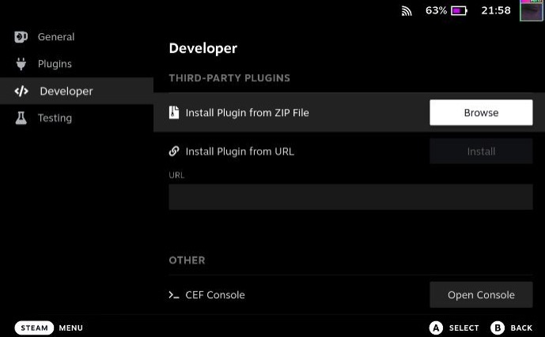
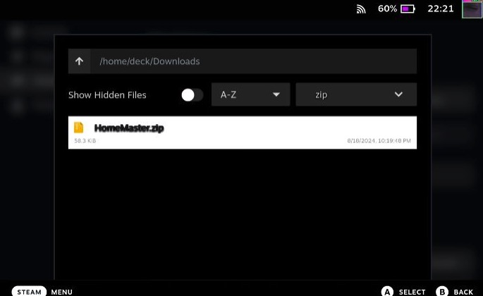
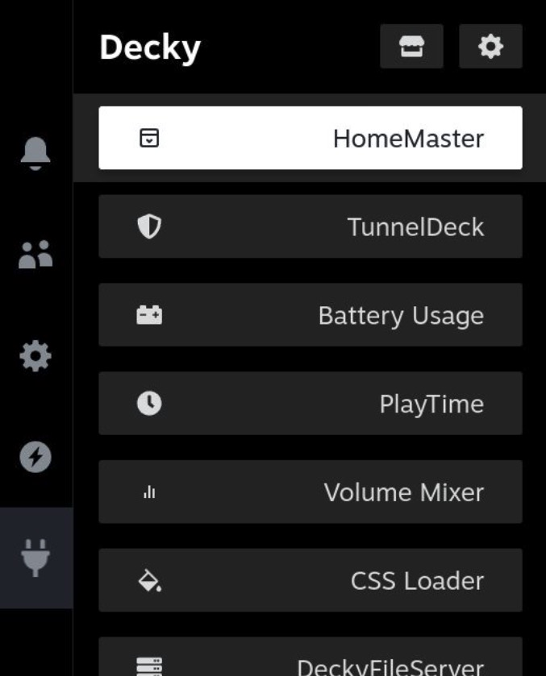
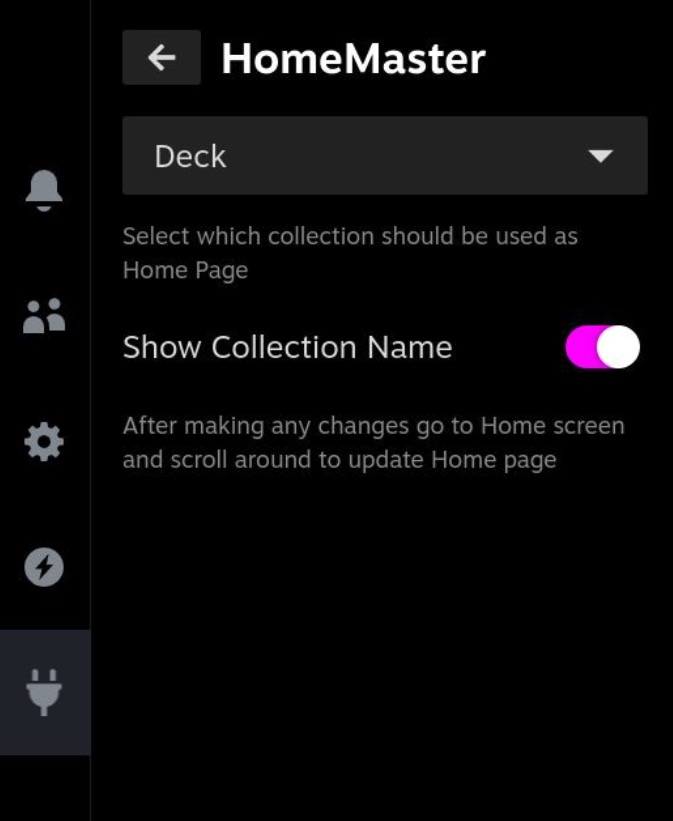

# How to install plugin manually

1. [Install decky loader plugin](https://github.com/SteamDeckHomebrew/decky-loader#installation)
2. Go to Desktop mode of your steam deck and download latest release of the plugin from [Releases](https://github.com/maslomeister/HomeMaster/releases)
3. After installation, open quick access menu by pressing `...` button on you deck and go to decky
4. Go to ⚙️ **_Settings_**, then **_General_**. Scroll down to **_OTHER_** and enable **_Developer mode_**
5. After that you'll see 2 new options appear on the left side of screen, go to **_Developer_** tab.

Finally, press on **_Browse_** button and select zip file with plugin that you downloaded earlier

After installation go back to Decky and you will see new plugin there

If after plugin installation, selecting collection and scrolling around in the Home page nothing doesn't seem to happen, you may need to **_Restart Steam_** from Power options.

At this point you can disable **_Developer mode_** if you want to.
